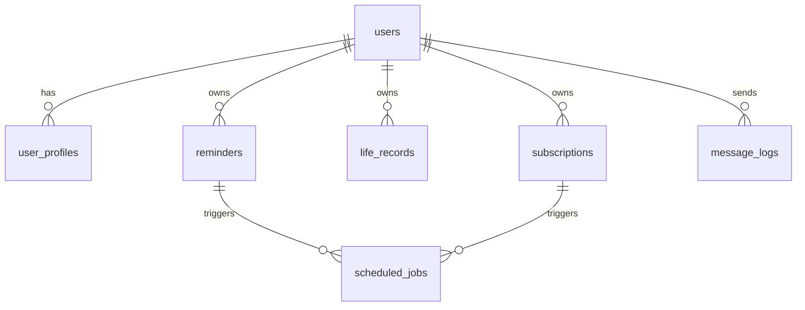

# 生活管家 Agent 数据库设计文档

## 1. 文档信息

- 文档版本：v0.1
- 创建日期：2026-06-05
- 数据库：PostgreSQL Docker 镜像，后续可升级阿里云 RDS PostgreSQL
- 缓存：Redis Docker 镜像，后续可升级阿里云 Redis/Tair
- 关联文档：`PRD.md`、`TECHNICAL_IMPLEMENTATION.md`

## 2. 设计目标

数据库设计需要支撑生活管家 Agent MVP 的核心能力：

- 微信公众号用户身份管理。
- 提醒和待办管理。
- 定时提醒主动推送。
- 每日简报订阅。
- 常见问答上下文记录。
- 用户长期偏好记忆。
- 微信 access_token 管理。
- 定时任务扫描、重试和追踪。

MVP 必须实现的表：

- `users`
- `user_profiles`
- `reminders`
- `subscriptions`
- `message_logs`
- `scheduled_jobs`
- `wechat_tokens`

MVP 可建表但暂不开放完整功能：

- `life_records`

## 3. 数据关系概览



说明：

- `users` 是用户根表，其他用户数据通过 `user_id` 关联。
- `wechat_tokens` 是系统级表，不归属于单个用户。
- `scheduled_jobs` 是任务调度表，可以关联 `reminders`、`subscriptions` 或系统任务。

## 4. 通用设计约定

## 4.1 主键与用户编号

采用“内部自增主键 + 对外数字用户编号”的策略：

- `id`：数据库内部主键，使用自增整数。
- `public_user_id`：用户对外展示和客服定位编号，按数字编号规则生成，数据库中使用 `bigint` 存储。

这样设计的原因：

- 自增 `id` 便于数据库索引、调试、排障和 join。
- `public_user_id` 便于客服、运营、日志检索和用户反馈问题时定位。
- `public_user_id` 不直接等于内部自增 `id`，可以避免完全暴露真实用户规模。
- 业务代码内部仍优先使用自增 `id` 做外键。

字段约定：

- 所有表的 `id` 类型建议为 `bigserial`。
- `users.public_user_id` 类型为 `bigint`，必须唯一。
- 其他表的 `user_id` 类型为 `bigint`，外键关联 `users.id`。

## 4.2 `public_user_id` 生成规则

用户对外编号由 5 段数字拼接：

```text
产品码 2 位 + 渠道码 2 位 + 年份 2 位 + 序列号 7 位 + 校验位 1 位
```

总长度 14 位。

存储约定：

- 数据库字段类型：`bigint`。
- 展示层按 14 位数字字符串展示。
- 不使用 `varchar` 存储，避免字符串索引和比较成本。
- 建议增加范围约束，确保编号为 14 位数字。

范围约束：

```sql
public_user_id >= 10000000000000
and public_user_id <= 99999999999999
```

示例：

```text
11012600000017
```

拆解：

```text
11       产品码：生活管家
01       渠道码：微信公众号
26       注册年份：2026
0000001  当年当渠道用户序列
7        校验位
```

字段含义：

| 段 | 长度 | 示例 | 说明 |
|---|---:|---|---|
| 产品码 | 2 | `11` | 生活管家产品线 |
| 渠道码 | 2 | `01` | 微信公众号渠道 |
| 年份 | 2 | `26` | 注册年份后两位 |
| 序列号 | 7 | `0000001` | 同产品、同渠道、同年份下递增 |
| 校验位 | 1 | `7` | 用于人工输入校验 |

MVP 默认编码：

- 产品码：`11`
- 微信公众号渠道码：`01`

序列号规则：

- 同一 `产品码 + 渠道码 + 年份` 下独立递增。
- 从 `0000001` 开始。
- 7 位序列最多支持 9,999,999 个用户。
- 生成时必须在数据库事务中完成，避免并发重复。

校验位规则：

- MVP 使用简单 `mod 10` 校验。
- 计算方式：前 13 位数字逐位求和后，对 10 取模。
- 校验位 = `sum(first_13_digits) % 10`。

示例：

```text
前 13 位：1101260000001
数字求和：1+1+0+1+2+6+0+0+0+0+0+0+1 = 12
校验位：12 % 10 = 2
完整 public_user_id：11012600000012
```

如后续需要更强校验，可以升级为 Luhn 算法，但 MVP 使用 `mod 10` 足够满足人工输入校验。

## 4.3 用户编号序列表

为避免直接使用 `users.id` 作为序列号，建议增加 `id_sequences` 表，统一管理业务编号递增。

字段建议：

| 字段 | 类型 | 必填 | 说明 |
|---|---|---|---|
| `id` | `bigserial` | 是 | 主键 |
| `sequence_key` | `varchar(128)` | 是 | 例如 `user:11:01:26` |
| `current_value` | `bigint` | 是 | 当前序列值 |
| `created_at` | `timestamptz` | 是 | 创建时间 |
| `updated_at` | `timestamptz` | 是 | 更新时间 |

索引建议：

- 唯一索引：`sequence_key`

生成流程：

1. 根据产品码、渠道码、年份生成 `sequence_key`。
2. 在数据库事务中锁定该 `sequence_key` 行。
3. `current_value + 1` 得到新序列。
4. 将序列补齐为 7 位。
5. 拼接前 13 位数字。
6. 计算校验位。
7. 写入 `users.public_user_id`。

并发要求：

- 必须使用数据库事务。
- 推荐使用 `select ... for update` 锁定序列表行。
- `users.public_user_id` 必须有唯一索引兜底。

## 4.4 时间字段

所有时间统一使用带时区时间：

- PostgreSQL 类型：`timestamptz`
- 应用内统一使用 UTC 存储。
- 用户展示时优先根据 `user_profiles.timezone` 转换；MVP 默认使用系统配置 `Asia/Shanghai`。

通用字段：

- `created_at`
- `updated_at`
- `deleted_at`

## 4.5 软删除

用户核心数据建议使用软删除：

- `deleted_at is null` 表示有效。
- 删除提醒、偏好、订阅时优先软删除。
- 消息日志可按数据保留策略做物理归档或删除。

## 4.6 状态字段

状态字段统一使用字符串枚举，便于调试和扩展。

常见状态：

- `active`
- `inactive`
- `pending`
- `completed`
- `cancelled`
- `failed`
- `deleted`

## 4.7 JSON 字段

灵活配置建议使用 `jsonb`：

- 订阅偏好。
- 微信原始消息摘要。
- 工具调用结果。
- 错误详情。

JSON 字段不能替代核心查询字段。经常查询或过滤的内容应独立成列。

## 5. 表设计

## 5.1 `users` 用户主表

## 5.1.1 表含义

`users` 是系统的用户身份中心，用于保存微信公众号用户和系统用户之间的映射关系。

用户第一次关注服务号或第一次发送消息时，如果系统中不存在对应 `wechat_openid`，就创建一条用户记录。

## 5.1.2 典型用途

- 判断当前微信用户是谁。
- 记录用户是否仍关注服务号。
- 作为提醒、订阅、记忆、消息日志的归属方。
- 保存用户身份、状态和关键互动时间。

## 5.1.3 字段建议

| 字段 | 类型 | 必填 | 说明 |
|---|---|---|---|
| `id` | `bigserial` | 是 | 内部用户主键 |
| `public_user_id` | `bigint` | 是 | 对外用户编号，展示层按 14 位数字字符串展示 |
| `wechat_openid` | `varchar(128)` | 是 | 微信公众号 OpenID |
| `status` | `varchar(32)` | 是 | `active`、`unsubscribed`、`blocked` |
| `subscribed_at` | `timestamptz` | 否 | 关注时间 |
| `last_active_at` | `timestamptz` | 否 | 最近互动时间 |
| `created_at` | `timestamptz` | 是 | 创建时间 |
| `updated_at` | `timestamptz` | 是 | 更新时间 |

## 5.1.4 索引建议

- 唯一索引：`wechat_openid`
- 唯一索引：`public_user_id`
- 普通索引：`status`
- 普通索引：`last_active_at`
- Check 约束：`public_user_id` 必须在 14 位数字范围内。

## 5.1.5 验证重点

- 同一个 `wechat_openid` 只能创建一个用户。
- 取消关注后 `status` 应变为 `unsubscribed`。
- 已取消关注用户不应接收主动推送。
- 默认城市、语言、时区、昵称、UnionID 不放在 MVP 用户主表中；默认城市等长期信息放入 `user_profiles`，UnionID 等跨应用身份后续需要时再扩展。

## 5.2 `user_profiles` 用户长期偏好表

## 5.2.1 表含义

`user_profiles` 保存用户明确表达的长期偏好，也就是 Agent 的长期记忆。

例如：

- `city = 上海浦东`
- `diet_avoid = 香菜`
- `news_preference = 科技,财经`
- `morning_brief_time = 08:00`

使用 key-value 结构是为了方便扩展，后续新增偏好类型时不需要频繁改表。

## 5.2.2 典型用途

- 生活问答个性化。
- 简报默认城市。
- 资讯偏好过滤。
- 用户查询“你记住了我哪些偏好”。
- 用户删除单条或全部长期记忆。

## 5.2.3 字段建议

| 字段 | 类型 | 必填 | 说明 |
|---|---|---|---|
| `id` | `bigserial` | 是 | 偏好 ID |
| `user_id` | `bigint` | 是 | 关联 `users.id` |
| `profile_key` | `varchar(128)` | 是 | 偏好键 |
| `profile_value` | `text` | 是 | 偏好值 |
| `value_type` | `varchar(32)` | 是 | `string`、`number`、`bool`、`json` |
| `source` | `varchar(64)` | 是 | `user_explicit`、`admin`、`imported` |
| `confidence` | `numeric(4,3)` | 否 | 置信度，默认 1.0 |
| `metadata` | `jsonb` | 否 | 原始表达、抽取信息 |
| `status` | `varchar(32)` | 是 | `active`、`deleted` |
| `created_at` | `timestamptz` | 是 | 创建时间 |
| `updated_at` | `timestamptz` | 是 | 更新时间 |
| `deleted_at` | `timestamptz` | 否 | 软删除时间 |

## 5.2.4 索引建议

- 唯一索引：`user_id + profile_key`，仅对未删除数据生效。
- 普通索引：`user_id + status`
- 普通索引：`profile_key`

## 5.2.5 验证重点

- 写入同类偏好时应覆盖或合并，不能无限重复。
- 删除全部记忆时只影响该用户。
- 临时对话内容不应误写入长期偏好。

## 5.3 `reminders` 提醒与待办表

## 5.3.1 表含义

`reminders` 保存用户的提醒和待办事项。

MVP 中提醒和待办可以共用一张表：

- 有 `scheduled_at`：提醒。
- 没有 `scheduled_at`：待办。
- 有 `repeat_rule`：周期提醒。
- 没有 `repeat_rule`：一次性提醒或普通待办。

## 5.3.2 典型用途

- 创建提醒。
- 查询今日提醒。
- 到期主动推送。
- 标记完成。
- 删除或取消提醒。

## 5.3.3 字段建议

| 字段 | 类型 | 必填 | 说明 |
|---|---|---|---|
| `id` | `bigserial` | 是 | 提醒 ID |
| `reminder_uuid` | `uuid` | 否 | 提醒对外业务标识 |
| `user_id` | `bigint` | 是 | 关联 `users.id` |
| `title` | `varchar(200)` | 是 | 提醒标题 |
| `content` | `text` | 否 | 详细内容 |
| `reminder_type` | `varchar(32)` | 是 | `reminder`、`todo` |
| `scheduled_at` | `timestamptz` | 否 | 下次提醒时间 |
| `timezone` | `varchar(64)` | 是 | 用户时区 |
| `repeat_rule` | `text` | 否 | RRULE 或内部周期表达 |
| `last_triggered_at` | `timestamptz` | 否 | 上次触发时间 |
| `next_trigger_at` | `timestamptz` | 否 | 下次触发时间 |
| `completed_at` | `timestamptz` | 否 | 完成时间 |
| `status` | `varchar(32)` | 是 | `active`、`completed`、`cancelled`、`deleted` |
| `source_message_id` | `bigint` | 否 | 来源消息日志 ID |
| `metadata` | `jsonb` | 否 | 原始时间表达、抽取槽位 |
| `created_at` | `timestamptz` | 是 | 创建时间 |
| `updated_at` | `timestamptz` | 是 | 更新时间 |
| `deleted_at` | `timestamptz` | 否 | 软删除时间 |

## 5.3.4 索引建议

- 普通索引：`user_id + status`
- 普通索引：`user_id + scheduled_at`
- 普通索引：`next_trigger_at + status`
- 普通索引：`reminder_type`
- 唯一索引：`reminder_uuid`，如果启用该字段

## 5.3.5 验证重点

- 同一次到期提醒不能重复推送。
- 周期提醒触发后要计算下一次 `next_trigger_at`。
- 删除提醒后对应未执行任务应取消。
- 已取消关注用户的提醒不应继续推送。

## 5.4 `life_records` 生活记录表

## 5.4.1 表含义

`life_records` 保存消费、饮食、运动、情绪、灵感等轻量记录。

MVP 可以先建表，但不一定开放完整统计能力。

## 5.4.2 典型用途

- 用户说“帮我记录一下……”时写入。
- 后续生成每日或每周总结。
- 后续做消费、饮食、运动统计。

## 5.4.3 字段建议

| 字段 | 类型 | 必填 | 说明 |
|---|---|---|---|
| `id` | `bigserial` | 是 | 记录 ID |
| `record_uuid` | `uuid` | 否 | 记录对外业务标识 |
| `user_id` | `bigint` | 是 | 关联 `users.id` |
| `record_type` | `varchar(64)` | 是 | `expense`、`food`、`exercise`、`mood`、`note` |
| `content` | `text` | 是 | 记录内容 |
| `amount` | `numeric(12,2)` | 否 | 金额，消费记录使用 |
| `currency` | `varchar(16)` | 否 | 默认 `CNY` |
| `tags` | `jsonb` | 否 | 标签列表 |
| `recorded_at` | `timestamptz` | 是 | 记录发生时间 |
| `source_message_id` | `bigint` | 否 | 来源消息日志 ID |
| `metadata` | `jsonb` | 否 | 原始抽取信息 |
| `status` | `varchar(32)` | 是 | `active`、`deleted` |
| `created_at` | `timestamptz` | 是 | 创建时间 |
| `updated_at` | `timestamptz` | 是 | 更新时间 |
| `deleted_at` | `timestamptz` | 否 | 软删除时间 |

## 5.4.4 索引建议

- 普通索引：`user_id + record_type + recorded_at`
- 普通索引：`user_id + recorded_at`

## 5.4.5 验证重点

- 记录必须归属于当前用户。
- 金额字段只在消费记录中使用。
- 健康、情绪等敏感记录需要遵守隐私策略。

## 5.5 `subscriptions` 订阅表

## 5.5.1 表含义

`subscriptions` 保存用户主动订阅的定时内容，例如每日早报、天气、科技新闻、财经简报、晚间总结。

它与 `reminders` 的区别是：

- `reminders` 是具体事项。
- `subscriptions` 是持续内容服务。

## 5.5.2 典型用途

- 每天早上推送天气和资讯。
- 工作日推送财经早报。
- 晚上推送今日总结。
- 根据用户偏好过滤资讯。

## 5.5.3 字段建议

| 字段 | 类型 | 必填 | 说明 |
|---|---|---|---|
| `id` | `bigserial` | 是 | 订阅 ID |
| `subscription_uuid` | `uuid` | 否 | 订阅对外业务标识 |
| `user_id` | `bigint` | 是 | 关联 `users.id` |
| `subscription_type` | `varchar(64)` | 是 | `daily_briefing`、`weather`、`news`、`evening_summary` |
| `schedule_rule` | `text` | 是 | 推送时间规则 |
| `timezone` | `varchar(64)` | 是 | 用户时区 |
| `preferences` | `jsonb` | 否 | 资讯类型、城市、关键词等 |
| `last_pushed_at` | `timestamptz` | 否 | 上次推送时间 |
| `next_push_at` | `timestamptz` | 否 | 下次推送时间 |
| `status` | `varchar(32)` | 是 | `active`、`paused`、`cancelled`、`deleted` |
| `created_at` | `timestamptz` | 是 | 创建时间 |
| `updated_at` | `timestamptz` | 是 | 更新时间 |
| `deleted_at` | `timestamptz` | 否 | 软删除时间 |

## 5.5.4 索引建议

- 普通索引：`user_id + status`
- 普通索引：`user_id + subscription_type + status`
- 普通索引：`next_push_at + status`
- 唯一索引：`subscription_uuid`，如果启用该字段

## 5.5.5 验证重点

- 同一用户同类订阅不能无限重复。
- 取消订阅后不能继续生成推送任务。
- 用户取消关注后订阅应暂停推送。

## 5.6 `message_logs` 消息日志表

## 5.6.1 表含义

`message_logs` 保存用户和系统之间的消息记录，以及 Agent 执行过程中的关键结果。

该表用于排查问题、分析用户需求、统计意图识别效果，以及后续生成短期上下文摘要。

## 5.6.2 典型用途

- 排查用户为什么没有收到提醒。
- 查看 Agent 识别出的意图。
- 统计常见请求类型。
- 追踪工具调用失败。

## 5.6.3 字段建议

| 字段 | 类型 | 必填 | 说明 |
|---|---|---|---|
| `id` | `bigserial` | 是 | 消息 ID |
| `message_uuid` | `uuid` | 否 | 消息对外业务标识 |
| `user_id` | `bigint` | 否 | 关联 `users.id`，系统级消息可为空 |
| `wechat_msg_id` | `varchar(128)` | 否 | 微信消息 ID |
| `direction` | `varchar(16)` | 是 | `inbound`、`outbound`、`system` |
| `message_type` | `varchar(32)` | 是 | `text`、`event`、`template`、`customer_service` |
| `content` | `text` | 否 | 消息内容，需按隐私策略控制 |
| `content_summary` | `text` | 否 | 脱敏摘要 |
| `agent_intent` | `varchar(64)` | 否 | Agent 识别意图 |
| `tool_name` | `varchar(128)` | 否 | 调用工具 |
| `tool_status` | `varchar(32)` | 否 | 工具执行状态 |
| `llm_provider` | `varchar(64)` | 否 | 模型供应商 |
| `llm_latency_ms` | `integer` | 否 | 模型耗时 |
| `raw_payload` | `jsonb` | 否 | 原始消息摘要，不保存过多隐私 |
| `error_code` | `varchar(64)` | 否 | 错误码 |
| `status` | `varchar(32)` | 是 | `success`、`failed`、`ignored` |
| `created_at` | `timestamptz` | 是 | 创建时间 |

## 5.6.4 索引建议

- 普通索引：`user_id + created_at`
- 普通索引：`agent_intent + created_at`
- 普通索引：`status + created_at`
- 普通索引：`wechat_msg_id`

## 5.6.5 验证重点

- 日志不能阻塞主流程。
- 敏感内容需要脱敏或限制保存。
- 微信重复消息可通过 `wechat_msg_id` 辅助去重。

## 5.7 `wechat_tokens` 微信凭证表

## 5.7.1 表含义

`wechat_tokens` 保存微信公众号接口调用所需的 token 状态。

微信公众号主动推送、菜单配置、用户标签等接口都依赖 `access_token`。该 token 有有效期，需要定时刷新。Redis 可作为缓存，数据库保留状态便于排查和恢复。

## 5.7.2 典型用途

- 保存当前 `access_token`。
- 保存过期时间。
- 记录刷新状态。
- 排查微信接口调用失败。

## 5.7.3 字段建议

| 字段 | 类型 | 必填 | 说明 |
|---|---|---|---|
| `id` | `bigserial` | 是 | 凭证 ID |
| `app_id` | `varchar(128)` | 是 | 微信公众号 AppID |
| `token_type` | `varchar(64)` | 是 | `access_token` |
| `token_value` | `text` | 是 | token 值，建议加密或限制权限 |
| `expires_at` | `timestamptz` | 是 | 过期时间 |
| `last_refreshed_at` | `timestamptz` | 否 | 最近刷新时间 |
| `refresh_status` | `varchar(32)` | 是 | `success`、`failed`、`refreshing` |
| `error_message` | `text` | 否 | 刷新失败原因 |
| `created_at` | `timestamptz` | 是 | 创建时间 |
| `updated_at` | `timestamptz` | 是 | 更新时间 |

## 5.7.4 索引建议

- 唯一索引：`app_id + token_type`
- 普通索引：`expires_at`

## 5.7.5 验证重点

- token 过期前应自动刷新。
- Redis 中 token 丢失时可以从数据库恢复。
- 刷新失败应记录并告警。

## 5.8 `scheduled_jobs` 定时任务表

## 5.8.1 表含义

`scheduled_jobs` 是主动推送和后台任务的调度中心。

它不是业务数据本身，而是记录“什么时候该执行什么任务”。业务数据保存在 `reminders`、`subscriptions` 等表里，`scheduled_jobs` 负责让任务可靠触发、可追踪、可重试。

## 5.8.2 典型用途

- 到时间推送提醒。
- 到时间生成每日简报。
- 刷新微信 access_token。
- 对失败推送进行重试。
- 追踪任务积压。

## 5.8.3 字段建议

| 字段 | 类型 | 必填 | 说明 |
|---|---|---|---|
| `id` | `bigserial` | 是 | 任务 ID |
| `job_uuid` | `uuid` | 否 | 任务对外业务标识 |
| `job_type` | `varchar(64)` | 是 | `reminder_push`、`briefing_push`、`token_refresh` |
| `user_id` | `bigint` | 否 | 关联 `users.id`，系统任务可为空 |
| `ref_type` | `varchar(64)` | 否 | `reminder`、`subscription`、`system` |
| `ref_id` | `bigint` | 否 | 关联业务内部 ID |
| `payload` | `jsonb` | 否 | 任务参数 |
| `next_run_at` | `timestamptz` | 是 | 下一次执行时间 |
| `locked_at` | `timestamptz` | 否 | 加锁时间 |
| `locked_by` | `varchar(128)` | 否 | 执行实例 |
| `started_at` | `timestamptz` | 否 | 开始时间 |
| `finished_at` | `timestamptz` | 否 | 结束时间 |
| `retry_count` | `integer` | 是 | 重试次数 |
| `max_retries` | `integer` | 是 | 最大重试次数 |
| `last_error` | `text` | 否 | 最近错误 |
| `status` | `varchar(32)` | 是 | `pending`、`running`、`success`、`failed`、`cancelled` |
| `created_at` | `timestamptz` | 是 | 创建时间 |
| `updated_at` | `timestamptz` | 是 | 更新时间 |

## 5.8.4 索引建议

- 普通索引：`next_run_at + status`
- 普通索引：`job_type + status`
- 普通索引：`user_id + status`
- 普通索引：`ref_type + ref_id`
- 唯一索引：`job_uuid`，如果启用该字段

## 5.8.5 验证重点

- 同一任务不能被多个 Worker 同时执行。
- 执行失败应更新重试次数和下一次执行时间。
- 业务对象取消后，对应任务应取消。
- 任务积压需要可监控。

## 6. Redis 使用设计

Redis 不作为核心业务数据的唯一存储，主要用于缓存、锁和短期状态。

建议 key：

| Key | 含义 | TTL |
|---|---|---|
| `wechat:access_token:{app_id}` | 微信 access_token 缓存 | 按过期时间设置 |
| `lock:scheduled_job:{job_id}` | 定时任务执行锁 | 1-5 分钟 |
| `conversation:{public_user_id}` | 短期对话上下文 | 30-120 分钟 |
| `rate_limit:{openid}` | 用户频率限制 | 1-60 分钟 |
| `idempotency:wechat_msg:{msg_id}` | 微信消息幂等 | 1-7 天 |

验证重点：

- Redis 丢失不能造成核心业务数据丢失。
- 任务锁必须设置 TTL。
- 幂等 key 应覆盖微信重复投递场景。

## 7. MVP 表优先级

| 表 | MVP 优先级 | 说明 |
|---|---|---|
| `users` | P0 | 微信用户身份根表 |
| `id_sequences` | P0 | 用户对外编号生成 |
| `reminders` | P0 | 提醒和待办核心 |
| `scheduled_jobs` | P0 | 主动推送和定时任务核心 |
| `message_logs` | P0 | 排障和链路追踪必须 |
| `subscriptions` | P0 | 每日简报核心 |
| `user_profiles` | P0 | 长期偏好和个性化核心 |
| `wechat_tokens` | P1 | 可用 Redis 简化，但建议保留 |
| `life_records` | P2 | 先建表预留，功能后续开放 |

## 8. 数据安全与隐私

要求：

- 所有用户数据必须按内部 `user_id` 隔离；对外展示、客服定位、日志关联优先使用 `public_user_id`。
- 日志中 `openid` 建议只保存哈希或脱敏结果。
- `message_logs.content` 需要数据保留周期。
- 健康、消费、证件等敏感内容后续需要独立授权策略。
- 用户删除全部记忆时，应删除或软删除 `user_profiles` 中该用户的有效数据。
- 用户取消关注后，主动推送任务应停止或暂停。

## 9. 数据库验收清单

| 验收项 | 标准 |
|---|---|
| 迁移 | Alembic 可以从空库迁移到最新版本 |
| 回滚 | 非破坏性迁移可以回滚 |
| 用户唯一性 | 同一 `wechat_openid` 只能对应一个用户 |
| 提醒查询 | 可以按用户和时间查询待触发提醒 |
| 任务扫描 | 可以按 `next_run_at + status` 扫描到期任务 |
| 订阅查询 | 可以按用户查询有效订阅 |
| 偏好删除 | 可以删除单条和全部长期偏好 |
| 日志写入 | 消息日志失败不影响主流程 |
| 幂等 | 微信重复消息不会重复创建核心业务数据 |
| 隐私 | 日志和偏好符合数据保留与删除策略 |
