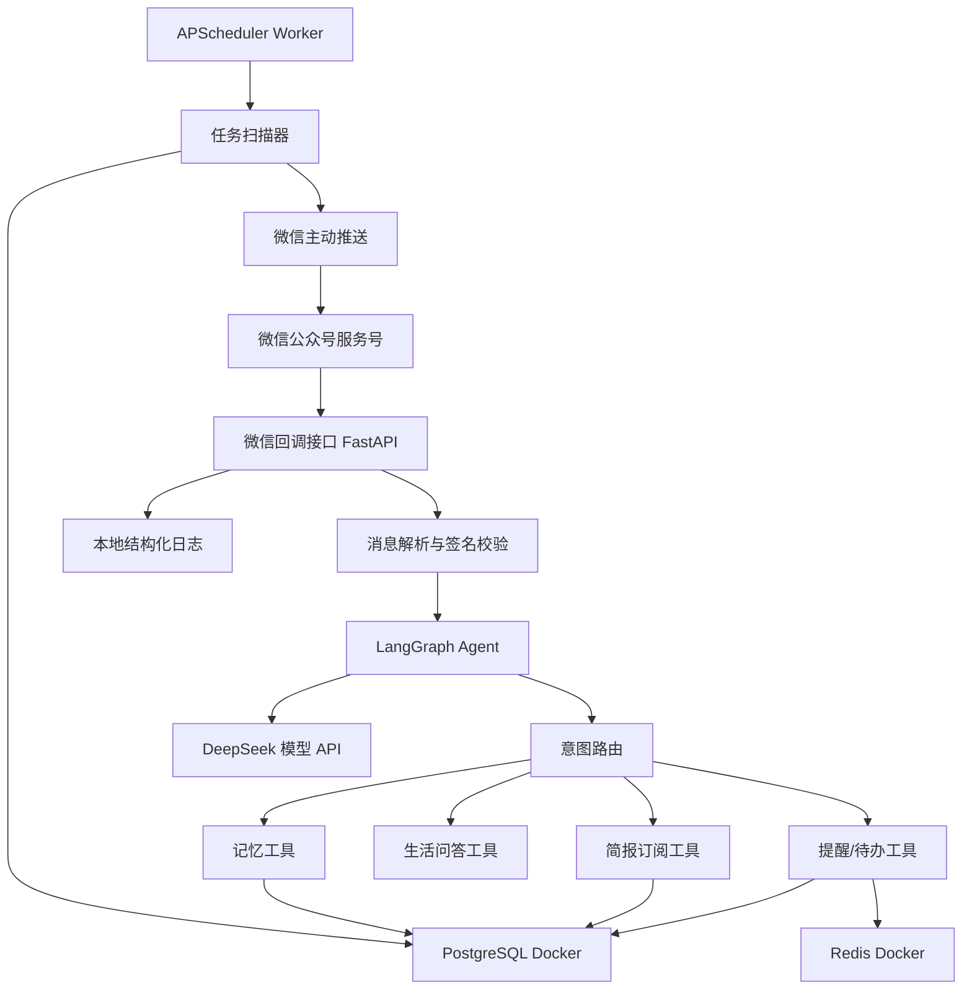

# 生活管家 Agent 技术实施文档

## 1. 文档信息

- 产品名称：生活管家 Agent
- 技术文档版本：v0.1
- 创建日期：2026-06-05
- 入口：微信公众号服务号
- 后端技术栈：Python、FastAPI、LangChain、LangGraph
- 模型：当前最新 DeepSeek 在线模型
- 生产基础设施：阿里云轻量应用服务器 + Docker Compose
- 关联文档：`PRD.md`、`DATABASE_DESIGN.md`

## 2. 实施目标

本技术文档用于指导生活管家 Agent MVP 的后端建设，明确每个阶段需要完成的事项、测试方法和功能验收标准。

MVP 交付范围：

- 微信公众号消息接入与回复。
- 用户关注、菜单点击、文本消息处理。
- DeepSeek 模型调用。
- LangGraph Agent 工作流。
- 提醒与待办管理。
- 定时提醒主动推送。
- 每日简报订阅与推送。
- 常见生活问题问答。
- 用户长期偏好记忆。
- 阿里云轻量应用服务器、Docker Compose、PostgreSQL Docker、Redis Docker、APScheduler Worker 接入；后续升级阿里云托管数据库、Redis/Tair、SLS、EventBridge。
- 基础管理能力和运维监控。

## 3. 总体架构

## 3.1 生产架构



## 3.2 推荐阿里云与 Docker 服务

| 能力 | MVP 初期推荐 | 后续扩展 |
|---|---|---|
| 应用部署 | 阿里云轻量应用服务器 + Docker Compose | ECS、ACK 或容器服务 |
| 反向代理 | Nginx/Caddy Docker 镜像 | SLB、ALB |
| 数据库 | PostgreSQL Docker 镜像 | 阿里云 RDS PostgreSQL、高可用版、只读实例 |
| 缓存 | Redis Docker 镜像 | 阿里云 Redis/Tair |
| 定时任务 | APScheduler Worker Docker 镜像 | EventBridge、独立 Worker |
| 异步队列 | Redis 队列 | RabbitMQ、RocketMQ、MNS |
| 日志 | 本地结构化日志和日志轮转 | SLS、SLS 告警、日志投递 OSS |
| 监控 | 轻量应用服务器基础监控 | 云监控、自定义指标、告警机器人 |
| 文件存储 | 本地挂载卷 | OSS |
| 密钥 | 环境变量 | KMS、RAM 最小权限、密钥轮换 |

## 3.3 Docker Compose 服务清单

MVP 初期所有服务基于 Docker 镜像部署在同一台阿里云轻量应用服务器上。

| 服务 | 镜像来源 | 作用 | 备注 |
|---|---|---|---|
| `app` | 项目自建 FastAPI 镜像 | 微信公众号回调、Agent API、内部管理接口 | 对内暴露应用端口 |
| `scheduler` | 项目自建 FastAPI 镜像 | 运行 APScheduler，扫描 `scheduled_jobs` | 与 `app` 使用同一镜像、不同启动命令 |
| `postgres` | 官方 PostgreSQL 镜像 | 主数据库 | 数据目录挂载到轻量应用服务器数据盘 |
| `redis` | 官方 Redis 镜像 | 缓存、幂等、任务锁、短期会话 | 数据目录可挂载，MVP 可轻持久化 |
| `nginx` 或 `caddy` | 官方镜像 | HTTPS、域名、反向代理 | Caddy 可简化证书自动签发 |
| `migrate` | 项目自建 FastAPI 镜像 | 执行 Alembic migration | 发布时一次性运行 |

镜像版本策略：

- 基础镜像锁定到小版本，不使用只锁主版本的浮动 tag。
- 当前版本：`python:3.11.15-slim-bookworm`、`postgres:16.14-alpine`、`redis:7.4.9-alpine`、`ghcr.io/astral-sh/uv:0.5.30`。
- Patch 版本升级需要通过本地测试、数据库迁移测试和生产冒烟测试。
- PostgreSQL、Redis 的 Minor/Major 升级需要单独评估兼容性，并在升级前备份数据卷。

部署要求：

- PostgreSQL、Redis 不直接暴露公网端口。
- 只有 HTTP/HTTPS 入口暴露到公网。
- 应用、调度器、数据库、Redis 通过 Docker Compose 内部网络访问。
- PostgreSQL 数据、日志、上传文件使用轻量应用服务器数据盘挂载卷。
- `.env` 文件只放在服务器，不能提交到代码仓库。

## 4. 阶段 0：项目准备

## 4.1 要做的事情

1. 确认微信公众号服务号后台能力：
   - AppID。
   - AppSecret。
   - Token。
   - EncodingAESKey。
   - 服务器配置权限。
   - 模板消息、订阅消息或客服消息权限。
   - 自定义菜单权限。
   - 用户标签能力。

2. 确认 DeepSeek API：
   - API Key。
   - Base URL。
   - 模型 ID。
   - 上下文长度。
   - 请求限流。
   - 价格和预算。

3. 确认阿里云资源：
   - 地域。
   - VPC。
   - 轻量应用服务器。
   - 安全组。
   - 数据盘与备份策略。
   - Docker 与 Docker Compose。
   - 后续升级所需的 RDS PostgreSQL、Redis/Tair、SLS、EventBridge、OSS 预算。
   - RAM 子账号或角色。

4. 确认域名与 HTTPS：
   - 用于微信公众号服务器配置的公网 HTTPS 地址。
   - 证书配置。
   - 备案状态。

## 4.2 输出物

- 微信公众号配置清单。
- DeepSeek 模型配置清单。
- 阿里云资源清单。
- `.env.example`。
- 项目初始化仓库。

## 4.3 测试

- 使用临时接口验证公网 HTTPS 可访问。
- 使用微信公众号后台完成服务器 URL 校验。
- 使用 DeepSeek API Key 发起一次测试调用。
- 使用本地脚本连接 PostgreSQL 和 Redis。

## 4.4 验收标准

- 微信公众号后台服务器配置验证通过。
- DeepSeek 测试调用返回正常文本。
- PostgreSQL、Redis 可被应用访问。
- 轻量应用服务器上 Docker Compose 服务能启动并写入本地日志。

## 5. 阶段 1：基础工程搭建

## 5.1 要做的事情

1. 初始化 Python 工程：
   - 建议使用 `uv` 或 `poetry` 管理依赖。
   - Python 版本建议 3.11 或 3.12。
   - 建立 `src/` 目录结构。

2. 建立推荐目录结构：

```text
src/
  app/
    main.py
    config.py
    logging.py
    dependencies.py
    api/
      health.py
      wechat.py
      admin.py
    agent/
      graph.py
      state.py
      prompts.py
      router.py
      nodes/
      tools/
    models/
    repositories/
    services/
      wechat/
      llm/
      scheduler/
      briefing/
      memory/
    workers/
    tests/
migrations/
configs/
scripts/
```

3. 引入基础依赖：
   - `fastapi`
   - `uvicorn`
   - `pydantic`
   - `pydantic-settings`
   - `sqlalchemy`
   - `alembic`
   - `asyncpg`
   - `redis`
   - `httpx`
   - `langchain`
   - `langgraph`
   - `pytest`
   - `pytest-asyncio`
   - `ruff`

4. 建立配置管理：
   - 读取 `.env`。
   - 区分 `local`、`test`、`prod`。
   - 敏感配置不写入代码仓库。

5. 建立日志：
   - JSON 结构化日志。
   - 每个请求生成 `request_id`。
   - 微信 `openid` 脱敏记录。
   - 模型请求只记录摘要、耗时、token 估算和状态。

6. 建立健康检查接口：
   - `GET /healthz`：应用存活。
   - `GET /readyz`：数据库、Redis、模型基础连通性。

## 5.2 测试

- 单元测试：
  - 配置加载测试。
  - 日志格式测试。
  - 健康检查接口测试。

- 集成测试：
  - 本地启动 FastAPI。
  - 访问 `/healthz` 返回 `200`。
  - `/readyz` 能检查 PostgreSQL 和 Redis。

## 5.3 验收标准

- 本地可一键启动应用。
- 所有基础测试通过。
- 日志包含 `request_id`。
- `.env.example` 覆盖所有必需配置项。

## 6. 阶段 2：数据库与数据模型

详细表结构、字段含义、索引、状态枚举、Redis key 设计以 `DATABASE_DESIGN.md` 为准。本章节只描述实施步骤、测试方式和验收标准。

## 6.1 要做的事情

1. 建立 Alembic 迁移。

2. 按 `DATABASE_DESIGN.md` 创建 MVP 核心表：
   - P0：`users`、`id_sequences`、`user_profiles`、`reminders`、`subscriptions`、`message_logs`、`scheduled_jobs`。
   - P1：`wechat_tokens`。
   - P2：`life_records`。

3. 按 `DATABASE_DESIGN.md` 创建核心索引：
   - 用户唯一性索引。
   - 提醒和订阅时间查询索引。
   - 定时任务扫描索引。
   - 消息日志排查索引。

4. 建立 Repository 层：
   - 用户查询与创建。
   - 用户对外编号生成。
   - 提醒 CRUD。
   - 订阅 CRUD。
   - 用户偏好 CRUD。
   - 消息日志写入。
   - 定时任务扫描和状态更新。

5. 实现 `public_user_id` 生成服务：
   - 编号规则：产品码 2 位 + 渠道码 2 位 + 年份 2 位 + 序列号 7 位 + 校验位 1 位。
   - MVP 产品码：`11`。
   - 微信公众号渠道码：`01`。
   - 序列表 key 示例：`user:11:01:26`。
   - 使用数据库事务和行锁递增 `id_sequences.current_value`。
   - 生成后写入 `users.public_user_id`。
   - `public_user_id` 使用 `bigint` 存储，展示层按 14 位数字字符串展示。
   - 通过唯一索引兜底防止重复编号。

6. 建立 Redis key 封装：
   - 微信 access_token 缓存。
   - 定时任务锁。
   - 微信消息幂等。
   - 用户短期会话。
   - 频率限制。

## 6.2 测试

- 单元测试：
   - Repository CRUD。
   - 时间字段默认值。
   - 软删除逻辑。
   - `public_user_id` 拼接规则。
   - `public_user_id` 校验位计算。
   - `public_user_id` 14 位范围约束。

- 集成测试：
   - Alembic 从空库迁移成功。
   - 创建用户后可以创建提醒和订阅。
   - 到期任务扫描只返回待执行任务。
   - 并发创建用户时 `public_user_id` 不重复。

## 6.3 验收标准

- 数据库迁移可重复执行。
- `DATABASE_DESIGN.md` 中 P0/P1 表和核心索引创建成功。
- 新用户创建时自动生成唯一 `public_user_id`。
- Repository 测试覆盖主要读写路径。
- 本地测试库可自动初始化和清理。

## 7. 阶段 3：微信公众号接入

## 7.1 要做的事情

1. 实现微信服务器校验：
   - 接收 `signature`、`timestamp`、`nonce`、`echostr`。
   - 按微信规则计算签名。
   - 校验通过后返回 `echostr`。

2. 实现消息回调接口：
   - 接收 XML。
   - 支持明文模式。
   - 预留兼容安全模式。
   - 解析文本消息、关注事件、取消关注事件、菜单点击事件。

3. 实现被动回复：
   - 文本回复 XML。
   - 异常兜底回复。
   - 超时保护。

4. 实现用户 OpenID 管理：
   - 首次消息自动创建用户。
   - 关注事件更新用户状态。
   - 取消关注事件更新用户状态。

5. 实现公众号菜单配置脚本：
   - 我的提醒。
   - 今日简报。
   - 偏好设置。
   - 更多能力。

6. 实现用户标签脚本：
   - 创建预留标签。
   - 查询标签。
   - 给用户打标签。

7. 实现 access_token 管理：
   - 定时刷新。
   - Redis 缓存。
   - 失败重试。

## 7.2 测试

- 单元测试：
  - 微信签名校验。
  - XML 解析。
  - XML 回复生成。
  - 关注、取消关注、菜单事件解析。

- 集成测试：
  - 使用模拟微信请求调用回调接口。
  - 新用户发送文本后自动创建用户。
  - 重复消息不会重复创建用户。
  - access_token 能写入 Redis。

- 手工测试：
  - 在微信公众号后台配置服务器地址。
  - 用微信关注服务号。
  - 发送“你好”。
  - 点击菜单。

## 7.3 验收标准

- 微信服务器配置验证通过。
- 用户发送文本消息后能收到回复。
- 关注、取消关注事件能写入日志。
- 菜单点击能触发对应回复。
- access_token 可自动刷新并缓存。

## 8. 阶段 4：DeepSeek 与 LLMProvider

## 8.1 要做的事情

1. 封装 `LLMProvider`：
   - `chat(messages, **kwargs)`。
   - 支持模型名配置。
   - 支持温度、最大输出长度。
   - 支持超时。
   - 支持重试。
   - 支持错误分类。

2. 实现 `DeepSeekProvider`：
   - 兼容 OpenAI 风格接口。
   - 使用 `httpx` 或兼容 SDK。
   - 记录请求耗时。
   - 记录调用状态。

3. 设计模型调用策略：
   - 普通问答温度较低。
   - 意图识别使用结构化输出。
   - 简报生成控制长度。
   - 工具调用失败时给出兜底回答。

4. 预留备用模型配置：
   - `LLM_PROVIDER=deepseek`。
   - `BACKUP_LLM_PROVIDER` 可为空。
   - 业务层不直接依赖 DeepSeek 类。

## 8.2 测试

- 单元测试：
  - LLMProvider 参数构造。
  - 超时和重试逻辑。
  - 模型错误映射。

- 集成测试：
  - 调用 DeepSeek 返回一句测试回答。
  - 模拟 API 失败时返回可识别错误。

- 成本测试：
  - 记录单次调用耗时。
  - 记录输入输出长度。

## 8.3 验收标准

- 业务代码只依赖 `LLMProvider` 抽象。
- DeepSeek 调用成功率、耗时和错误能被日志记录。
- API 失败不会导致公众号回调崩溃。

## 9. 阶段 5：LangGraph Agent 工作流

## 9.1 要做的事情

1. 定义 Agent State：
   - `user_id`
   - `openid`
   - `raw_message`
   - `normalized_message`
   - `user_profile`
   - `recent_context`
   - `intent`
   - `slots`
   - `tool_result`
   - `final_response`
   - `need_confirmation`

2. 实现节点：
   - `input_guardrail`：输入清洗、长度限制、基础安全检查。
   - `context_loader`：加载用户画像、近期提醒、近期对话摘要。
   - `intent_router`：识别意图。
   - `task_agent`：提醒和待办。
   - `briefing_agent`：订阅和简报。
   - `qa_agent`：生活问答。
   - `memory_agent`：长期偏好。
   - `tool_executor`：执行工具。
   - `response_composer`：生成微信回复。

3. 实现意图类型：
   - `create_reminder`
   - `update_reminder`
   - `delete_reminder`
   - `query_reminder`
   - `create_todo`
   - `complete_todo`
   - `subscribe_briefing`
   - `unsubscribe_briefing`
   - `query_briefing`
   - `general_qa`
   - `set_preference`
   - `query_preference`
   - `delete_preference`
   - `unknown`

4. 实现结构化槽位：
   - 时间。
   - 周期规则。
   - 事项标题。
   - 事项内容。
   - 订阅类型。
   - 推送时间。
   - 偏好 key/value。

5. 实现确认机制：
   - 删除多个提醒需要确认。
   - 高度模糊时间需要确认。
   - 高频推送需要确认。
   - 删除全部记忆需要确认。

## 9.2 测试

- 单元测试：
  - 意图识别样例集。
  - 槽位抽取样例集。
  - 路由分支测试。
  - 确认机制测试。

- 集成测试：
  - 输入“明早 8 点提醒我带身份证”，输出创建提醒工具调用。
  - 输入“每天早上 8 点给我发天气和科技新闻”，输出订阅工具调用。
  - 输入“我不吃香菜，以后记住”，输出偏好写入。
  - 输入“空气炸锅怎么清洗”，进入问答节点。

## 9.3 验收标准

- 常见样例意图识别准确率达到 90% 以上。
- 关键信息缺失时可以追问。
- 工具执行结果可以被转成微信友好回复。
- Agent 异常时有兜底回复和错误日志。

## 10. 阶段 6：提醒与待办功能

## 10.1 要做的事情

1. 实现提醒创建：
   - 一次性提醒。
   - 周期提醒。
   - 模糊时间默认值。
   - 缺失信息追问。

2. 实现提醒查询：
   - 查询今天提醒。
   - 查询未来提醒。
   - 查询全部未完成提醒。

3. 实现提醒删除：
   - 删除单个提醒。
   - 多个匹配时要求用户确认。

4. 实现待办：
   - 无时间事项创建为待办。
   - 待办完成。
   - 待办查询。

5. 实现时间解析：
   - 支持“明天早上”。
   - 支持“今晚 8 点”。
   - 支持“每周三晚上”。
   - 支持“工作日早上 8 点”。

6. 实现任务触发：
   - 到期扫描。
   - 推送消息。
   - 状态更新。
   - 失败重试。

## 10.2 测试

- 单元测试：
  - 时间解析。
  - 重复规则生成。
  - 提醒 CRUD。
  - 待办完成逻辑。

- 集成测试：
  - 创建提醒后数据库存在记录。
  - 到期扫描能找到提醒。
  - 执行推送后提醒状态更新。
  - 周期提醒触发后生成下一次触发时间。

- 手工测试：
  - 微信发送“明早 8 点提醒我带身份证”。
  - 微信发送“今天有什么提醒”。
  - 微信发送“取消带身份证的提醒”。

## 10.3 验收标准

- 用户可以通过自然语言创建提醒。
- 用户可以查询提醒。
- 用户可以删除提醒。
- 到期提醒可以主动推送到微信。
- 周期提醒不会重复推送同一次任务。

## 11. 阶段 7：每日简报与资讯

## 11.1 要做的事情

1. 实现订阅管理：
   - 创建订阅。
   - 查询订阅。
   - 修改订阅。
   - 取消订阅。

2. 接入天气 API：
   - 根据用户城市获取天气。
   - 无城市时追问或使用默认城市。
   - 天气接口失败时跳过天气模块。

3. 接入 RSS 或开放新闻 API：
   - 配置白名单来源。
   - 拉取标题、链接、发布时间。
   - 去重。
   - 过滤过旧内容。

4. 生成简报：
   - 今日天气。
   - 今日提醒。
   - 重要资讯 3-5 条。
   - 来源标注。
   - 适合微信阅读的短文本。

5. 实现定时推送：
   - 根据订阅时间生成任务。
   - 到点生成简报。
   - 发送微信消息。
   - 记录推送状态。

## 11.2 测试

- 单元测试：
  - RSS 解析。
  - 新闻去重。
  - 简报模板生成。
  - 订阅 CRUD。

- 集成测试：
  - 订阅每日 8 点早报。
  - 定时任务扫描到订阅。
  - 生成简报。
  - 推送消息。

- 内容测试：
  - 简报长度适合微信。
  - 每条资讯有来源。
  - 无天气或新闻数据时仍能返回可读结果。

## 11.3 验收标准

- 用户可以订阅每日简报。
- 用户可以取消订阅。
- 定时简报可以主动推送。
- 简报包含天气、提醒、资讯来源。
- 资讯内容不搬运长篇原文。

## 12. 阶段 8：常见生活问答

## 12.1 要做的事情

1. 实现问答 Prompt：
   - 简洁。
   - 可执行。
   - 不确定时说明限制。
   - 医疗、法律、金融类问题加入风险提示。
   - 地域和政策类问题建议参考官方渠道。

2. 实现问答路由：
   - 非任务类问题进入 `qa_agent`。
   - 可结合用户长期偏好回答。

3. 实现回答长度控制：
   - 微信回复不宜过长。
   - 超长回答拆分或摘要。

4. 实现安全兜底：
   - 高风险问题不做确定性建议。
   - 不协助违法违规行为。

## 12.2 测试

- 单元测试：
  - 问答 Prompt 快照测试。
  - 高风险问题分类测试。

- 集成测试：
  - “空气炸锅怎么清洗？”
  - “怎么规划一周晚餐？”
  - “感冒了能喝咖啡吗？”
  - “上海办理居住证需要什么？”

## 12.3 验收标准

- 普通生活问题可以给出清晰回答。
- 高风险问题包含免责声明或建议咨询专业人士。
- 问答结果不会破坏提醒、简报、记忆流程。

## 13. 阶段 9：用户长期偏好记忆

## 13.1 要做的事情

1. 实现偏好识别：
   - 城市。
   - 作息。
   - 饮食。
   - 资讯偏好。
   - 推送时间偏好。
   - 禁忌或不喜欢的内容。

2. 实现偏好写入：
   - 用户明确表达长期偏好时写入。
   - 歧义场景追问。
   - 同类偏好可覆盖或追加。

3. 实现偏好查询：
   - “你记住了我哪些偏好？”

4. 实现偏好删除：
   - 删除单条。
   - 删除全部。
   - 删除全部前要求确认。

5. 实现偏好使用：
   - 简报过滤。
   - 问答个性化。
   - 默认城市。
   - 默认推送时间。

## 13.2 测试

- 单元测试：
  - 偏好 key 归一化。
  - 偏好写入。
  - 偏好删除。
  - 删除全部确认。

- 集成测试：
  - 输入“我住在上海浦东，以后默认用这个城市”。
  - 查询记忆。
  - 删除城市偏好。
  - 删除全部记忆。

## 13.3 验收标准

- 长期偏好能被保存和读取。
- 用户能删除单条和全部记忆。
- 删除全部需要二次确认。
- 偏好能影响简报和问答。

## 14. 阶段 10：主动推送与任务调度

## 14.1 要做的事情

1. 设计 `scheduled_jobs`：
   - 任务类型。
   - 关联业务 ID。
   - `next_run_at`。
   - 状态。
   - 重试次数。
   - 错误信息。

2. 实现任务扫描器：
   - 每分钟扫描到期任务。
   - 加锁避免重复执行。
   - 执行成功更新状态。
   - 执行失败进入重试。

3. 实现推送服务：
   - 模板消息、订阅消息或客服消息适配。
   - 发送失败记录错误。
   - 用户取消关注时停止推送。

4. 实现任务幂等：
   - 同一任务同一触发时间只执行一次。
   - Redis 锁设置过期时间。

5. 实现告警：
   - 推送失败率过高。
   - 定时扫描器异常。
   - DeepSeek 调用失败率过高。

## 14.2 测试

- 单元测试：
  - 到期任务查询。
  - 任务锁。
  - 重试时间计算。

- 集成测试：
  - 创建一个一分钟后触发的提醒。
  - 扫描器执行任务。
  - 推送成功后状态更新。
  - 重复扫描不会重复推送。

- 故障测试：
  - 模拟微信接口失败。
  - 模拟 Redis 不可用。
  - 模拟数据库短暂异常。

## 14.3 验收标准

- 到期任务可以准时触发。
- 重复扫描不会重复发送。
- 失败任务可重试。
- 关键失败能进入日志和告警。

## 15. 阶段 11：基础管理能力

## 15.1 要做的事情

MVP 不做完整 Web 后台，但需要内部管理能力。

1. 管理接口：
   - 查询用户数量。
   - 查询消息日志。
   - 查询提醒任务。
   - 查询订阅。
   - 手动触发简报。
   - 手动触发任务扫描。

2. 配置管理：
   - 资讯源配置。
   - 默认城市。
   - 默认早报时间。
   - Prompt 版本。
   - 模型参数。

3. 权限：
   - 管理接口需要鉴权。
   - 生产环境禁止无鉴权访问。

4. 运维脚本：
   - 初始化公众号菜单。
   - 初始化用户标签。
   - 初始化资讯源。
   - 检查微信 access_token。

## 15.2 测试

- 单元测试：
  - 配置读取。
  - 管理接口鉴权。

- 集成测试：
  - 管理接口无 token 返回 401。
  - 管理接口有 token 返回数据。
  - 手动触发简报生成成功。

## 15.3 验收标准

- 内部人员可以查询基础运行状态。
- 管理接口有鉴权。
- 可手动触发测试推送和任务扫描。

## 16. 阶段 12：部署与发布

## 16.1 要做的事情

1. 准备 Dockerfile：
   - 非 root 用户运行。
   - 依赖安装缓存。
   - 健康检查。

2. 准备部署配置：
   - 生产环境变量。
   - PostgreSQL Docker 连接。
   - Redis 连接。
   - DeepSeek API Key。
   - 微信公众号配置。
   - 本地结构化日志和日志轮转配置。

3. 数据库迁移：
   - 发布前执行 Alembic。
   - 迁移失败阻断发布。

4. 发布应用：
   - 部署到阿里云轻量应用服务器。
   - 配置 HTTPS 域名。
   - 配置微信公众号服务器 URL。

5. 配置定时任务：
   - MVP 初期使用 APScheduler Worker Docker 镜像。
   - 后续可升级 EventBridge 或独立 Worker。
   - 配置任务扫描入口。

6. 配置监控告警：
   - 5xx 错误。
   - 微信回调超时。
   - 模型调用失败。
   - 推送失败。
   - 任务积压。

## 16.2 测试

- 发布前测试：
  - 所有单元测试通过。
  - 所有集成测试通过。
  - 数据库迁移测试通过。
  - Docker 镜像可启动。

- 生产冒烟测试：
  - `/healthz` 正常。
  - `/readyz` 正常。
  - 微信公众号发送“你好”正常回复。
  - 创建提醒成功。
  - 手动触发提醒推送成功。
  - 手动触发简报成功。

## 16.3 验收标准

- 生产服务稳定运行。
- 微信公众号消息链路打通。
- 数据库、Redis、日志正常工作。
- 定时任务可触发。
- 告警规则生效。

## 17. 全链路功能验证清单

## 17.1 微信入口验证

| 用例 | 输入 | 预期结果 |
|---|---|---|
| 关注服务号 | 用户关注 | 创建或激活用户，返回欢迎语 |
| 文本问候 | “你好” | 返回生活管家介绍或可用能力 |
| 菜单点击 | 点击“我的提醒” | 返回当前提醒列表或空状态 |
| 取消关注 | 用户取消关注 | 用户状态更新为未关注，停止主动推送 |

## 17.2 提醒验证

| 用例 | 输入 | 预期结果 |
|---|---|---|
| 创建一次性提醒 | “明早 8 点提醒我带身份证” | 创建提醒并返回确认 |
| 查询提醒 | “今天有什么提醒” | 返回今日提醒列表 |
| 删除提醒 | “取消带身份证的提醒” | 删除或要求确认 |
| 周期提醒 | “每周三晚上提醒我倒垃圾” | 创建周期提醒 |
| 到期推送 | 到达提醒时间 | 微信主动推送提醒 |

## 17.3 简报验证

| 用例 | 输入 | 预期结果 |
|---|---|---|
| 创建订阅 | “每天早上 8 点给我发天气和科技新闻” | 创建订阅 |
| 查询订阅 | “我订阅了什么” | 返回订阅列表 |
| 取消订阅 | “取消每日简报” | 取消订阅 |
| 定时推送 | 到达推送时间 | 发送天气、提醒、资讯摘要 |

## 17.4 问答验证

| 用例 | 输入 | 预期结果 |
|---|---|---|
| 普通生活问答 | “空气炸锅怎么清洗” | 返回步骤化建议 |
| 饮食规划 | “帮我规划一周晚餐” | 返回可执行建议 |
| 医疗风险问题 | “感冒了能喝咖啡吗” | 返回谨慎建议和风险提示 |
| 政策类问题 | “上海办理居住证需要什么” | 返回概览并建议查官方渠道 |

## 17.5 记忆验证

| 用例 | 输入 | 预期结果 |
|---|---|---|
| 写入偏好 | “我不吃香菜，以后记住” | 保存饮食偏好 |
| 查询偏好 | “你记住了我哪些偏好” | 返回长期偏好列表 |
| 删除单条 | “删除我不吃香菜这条” | 删除对应偏好 |
| 删除全部 | “删除我的所有记忆” | 要求确认，确认后删除 |

## 18. 测试策略

## 18.1 测试分层

- 单元测试：工具函数、时间解析、Repository、Prompt 构造、签名校验。
- 集成测试：数据库、Redis、DeepSeek、微信公众号模拟请求、任务扫描。
- 端到端测试：微信公众号真实消息链路、提醒推送、简报推送。
- 回归测试：核心样例集固定，每次发布前运行。
- 故障测试：外部 API 失败、超时、数据库失败、Redis 失败。

## 18.2 核心测试命令

```bash
ruff check .
pytest
pytest tests/integration
alembic upgrade head
```

## 18.3 发布前最低测试门槛

- 单元测试通过率 100%。
- 核心集成测试通过。
- 微信服务器校验通过。
- DeepSeek 调用测试通过。
- 创建提醒、查询提醒、触发提醒三条主链路通过。
- 创建简报订阅、生成简报、推送简报三条主链路通过。

## 19. 观测与告警

## 19.1 必须记录的日志字段

- `request_id`
- `openid_hash`
- `message_type`
- `intent`
- `tool_name`
- `tool_status`
- `llm_provider`
- `llm_latency_ms`
- `wechat_api_status`
- `error_code`
- `created_at`

## 19.2 指标

- 微信回调响应时间。
- 微信回调 5xx 数量。
- Agent 执行耗时。
- DeepSeek 调用失败率。
- 工具调用失败率。
- 定时任务积压数。
- 推送成功率。
- 单用户每日模型调用次数。

## 19.3 告警

- 5 分钟内微信回调 5xx 超过阈值。
- DeepSeek 调用失败率超过阈值。
- 定时任务积压超过阈值。
- 推送失败率超过阈值。
- PostgreSQL 或 Redis 连接失败。

## 20. 风险与回滚

## 20.1 主要风险

- 微信主动推送权限与频率限制。
- DeepSeek API 超时或限流。
- 资讯源质量不稳定。
- 定时任务重复触发。
- 用户隐私数据误记录。

## 20.2 降级策略

- DeepSeek 不可用：返回稍后再试，并记录失败。
- 新闻源不可用：简报只发天气和提醒。
- 天气 API 不可用：简报跳过天气模块。
- Redis 不可用：禁用幂等锁，任务执行进入保护模式。
- 微信推送失败：记录失败，按重试策略重试。

## 20.3 回滚策略

- 应用发布保留上一版本镜像。
- 数据库迁移避免破坏性变更。
- 新功能使用配置开关控制。
- 公众号菜单和标签脚本可重复执行。
- 定时任务支持暂停开关。

## 21. MVP 完成定义

当以下条件全部满足时，MVP 后端可视为完成：

- 公众号真实用户可以发送文本消息并收到回复。
- 用户可以创建、查询、删除提醒。
- 到期提醒可以主动推送。
- 用户可以订阅、取消每日简报。
- 每日简报可以定时推送。
- 用户可以进行常见生活问答。
- 用户长期偏好可以保存、查询和删除。
- PostgreSQL、Redis、日志、定时任务在生产环境可用。
- 关键链路有单元测试、集成测试和手工验收记录。
- 失败链路有日志和基础告警。
